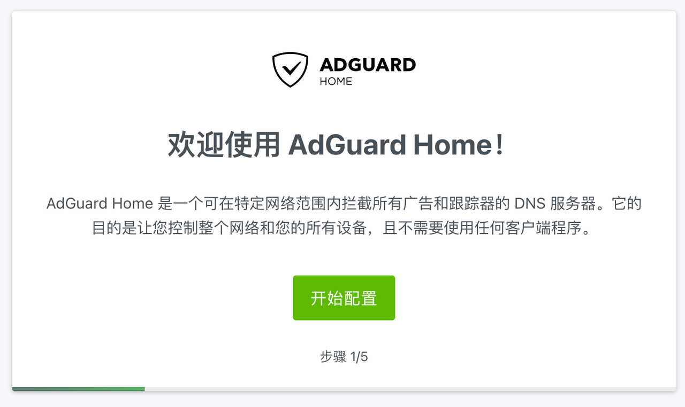
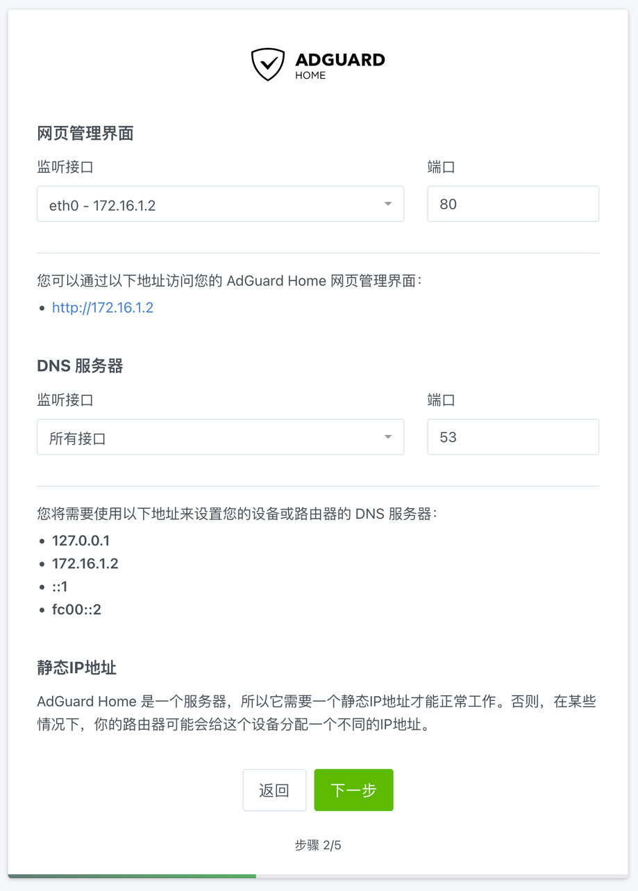
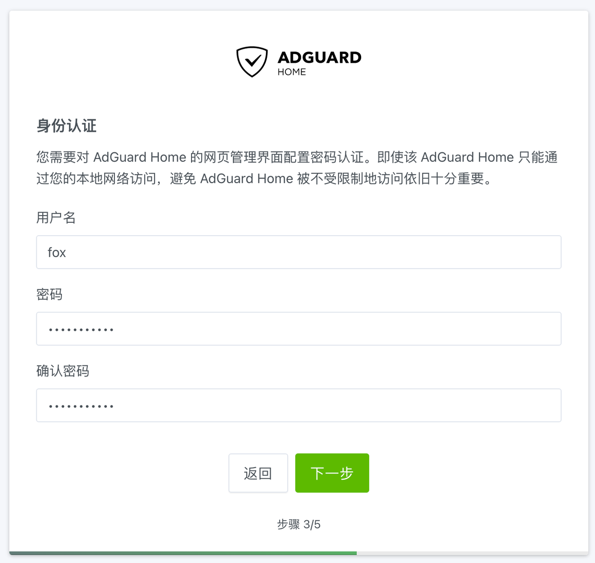
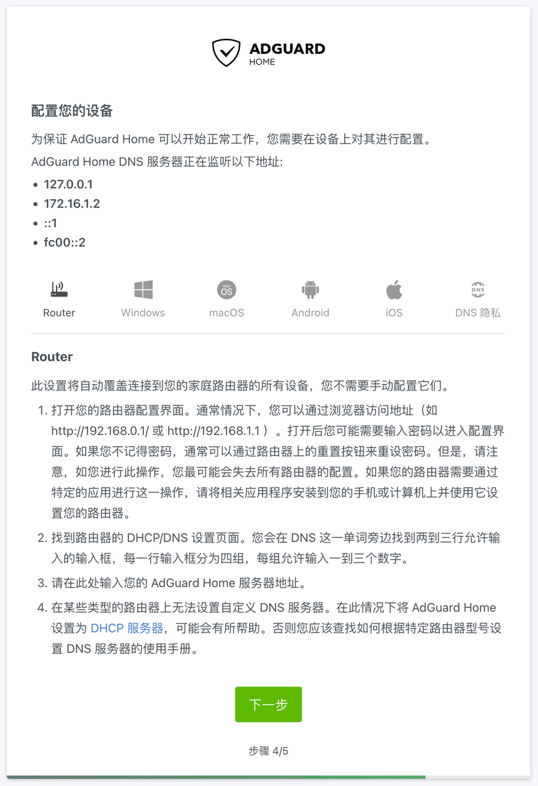
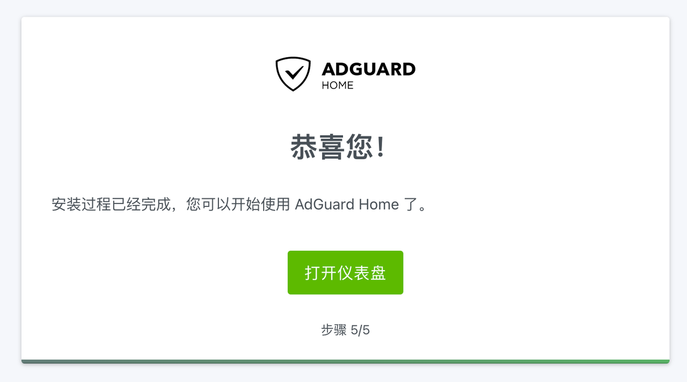

## 0.前景提要

在我 PVE 的系列文章《[Proxmox VE 折腾手记](https://gitee.com/callmer/pve_toss_notes)》中，已经制作好了基于 Debian 云镜像的虚拟机模板。  

并用该模板克隆出来了一台作为内网 DNS 服务器的虚拟机 `DNS001` 。  

接下来将用这台虚拟机完成 Adguard Home 的初始化配置。

## 1.配置 AGH

在 `DNS001` 的 `Cloud-Init` 配置中，设置了该服务器的 IP 地址 `172.16.1.2` 。  

在浏览器中访问 `http://172.16.1.2:3000` 即可打开 Adguard Home 的配置界面：

点击 `开始配置` 按钮。

## 2. AGH 配置服务

在 Adguard Home 的服务配置界面，可以配置 Adguard Home 的管理界面和 DNS 服务的相关参数。  

网页管理界面的监听接口选择 `eth0 - 172.16.1.2` ，端口为 `80` 。  

DNS 服务器的监听接口选择 `所有接口` ，端口为 `53` 。

## 3. AGH 创建账户

接下来需要配置 Adguard Home WEB 管理界面的账户和密码。  

密码建议使用高强度密码。

## 4. AGH 用户引导

Adguard Home 将会指引用户配置内网设备 DNS 服务器。  

## 5. AGH 设置完成

Adguard Home 配置完成后，点击 `打开仪表盘` 按钮，即可进入 Adguard Home 的 WEB 管理界面。  

