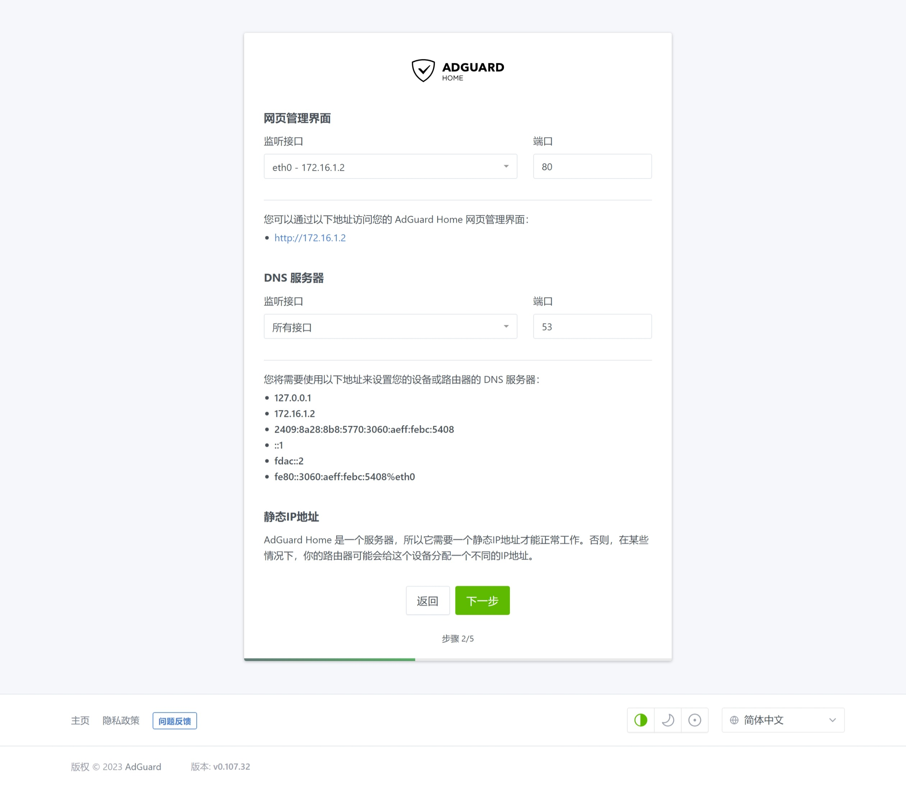

## 0.前景提要

在 PVE 系列文章 [Proxmox VE 折腾手记](https://gitee.com/callmer/pve_toss_notes) 中，已经制作好了基于 Debian 云镜像的虚拟机模板。  

并用该模板克隆了一台作为内网 DNS 服务器的虚拟机 `DNS01` 。  

接下来将完成 Adguard Home 的初始化配置。  

## 1.配置 AGH

在 `DNS01` 的 `Cloud-Init` 配置中，设置了该服务器的 IPv4 地址 `172.16.1.2` 。  

浏览器中访问 `http://172.16.1.2:3000` ，即可打开 Adguard Home 的初始化页面，点击 `开始配置` 。  

## 2. AGH 服务

网页管理界面的 `监听接口` 选择 `eth0 - 172.16.1.2` ，端口设置为 `80` 。  

DNS 服务器的 `监听接口` 选择 `所有接口` ，端口设置为 `53` 。  

## 3. AGH 账户

配置 Adguard Home 管理界面的账户和密码，建议使用高强度密码。  

## 4. AGH 用户引导

Adguard Home 将会指引用户配置内网设备 DNS 服务器。  

## 5. AGH 设置完成

Adguard Home 配置完成后，点击 `打开仪表盘` ，即可进入 Adguard Home 的网页管理界面。  

