## 1.登录 AGH 管理后台

Adguard Home 服务器的 IP 地址为 `172.16.1.2` ，因此在浏览器中访问 `http://172.16.1.2` 即可打开 Adguard Home 管理后台的登录界面： 

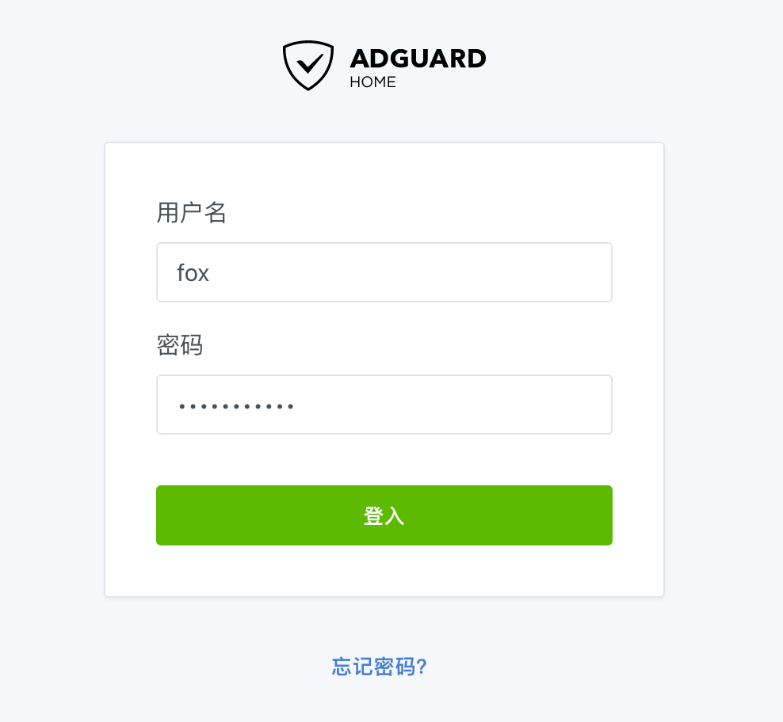

## 2. AGH 仪表盘

Adguard Home 的仪表盘将显示近期的一些统计数据：

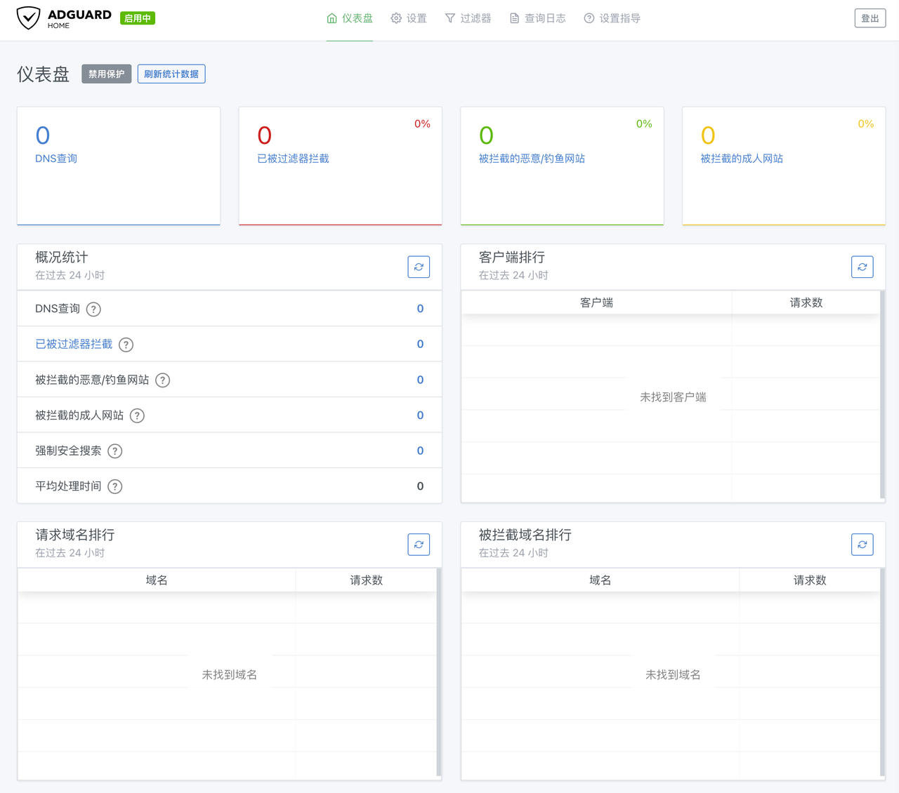

## 3.常规设置

点击顶部菜单 `设置` 的子菜单 `常规设置` ，修改其中的配置：

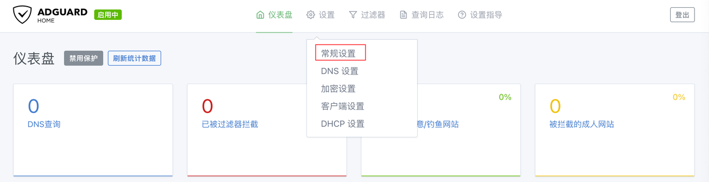

在 `常规设置` 页面，将 `过滤器` 的更新周期设置为 `12小时` ：

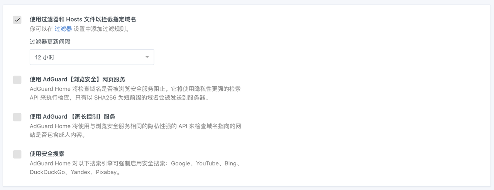

将 `日志配置` 的 `查询记录保留时间` 设置为 `24小时` ，并点击 `保存` 按钮：

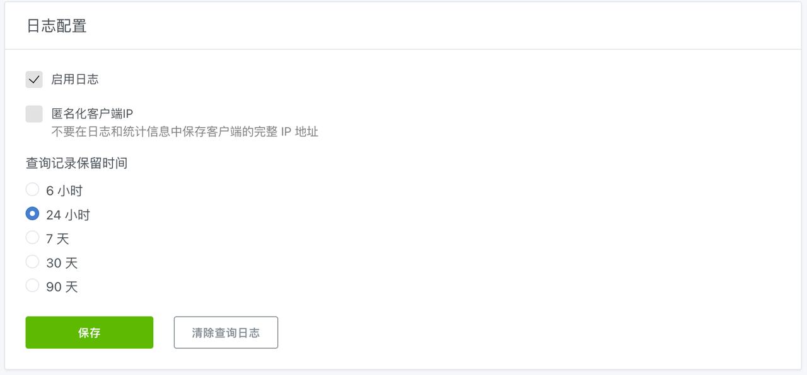  

`统计配置` 的 `统计保留` 保持 `24小时` 不变：

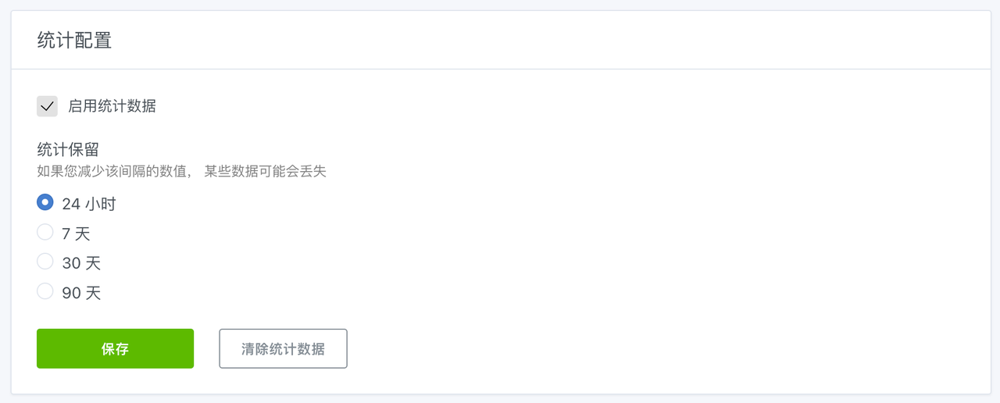

## 4.DNS设置

`DNS设置` 为 Adguard Home 的核心配置内容。点击顶部菜单 `设置` 的子菜单 `DNS设置` ，修改其中的配置：

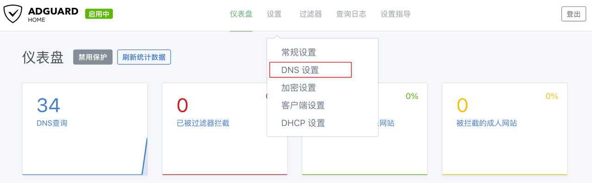

### 4.1.上游DNS服务器

目前国内 DoH 服务器的响应时间比 DoT 服务器更快，因此推荐将内网第一台 DNS 服务器使用 DoH 服务器，第二台备用 DNS 服务器使用 DoT 服务器。  

国内 DoH 服务器地址如下：

```txt
https://doh.pub/dns-query
https://dns.alidns.com/dns-query
https://doh.360.cn/dns-query
https://dns.ipv6dns.com/dns-query
```

国内 DoT 服务器地址如下：

```txt
tls://dot.pub
tls://dns.alidns.com
tls://dot.360.cn
tls://dns.ipv6dns.com
```

在 `上游 DNS 服务器` 文本框中输入国内的 DoH 或 DoT 的服务器地址，并选择 `负载均衡` 。  

**说明：**  

**在某些场景下，可能需要额外指定 DNS 服务器来解析内网域名。**    

**此时只需要在 `上游 DNS 服务器` 中添加内网域名 DNS 服务器即可，一般为路由器的 IP 地址。**   

**这里以 `fox.local` 和 `172.16.1.1` 作为演示。**   

```txt
[/fox.local/]172.16.1.1
```

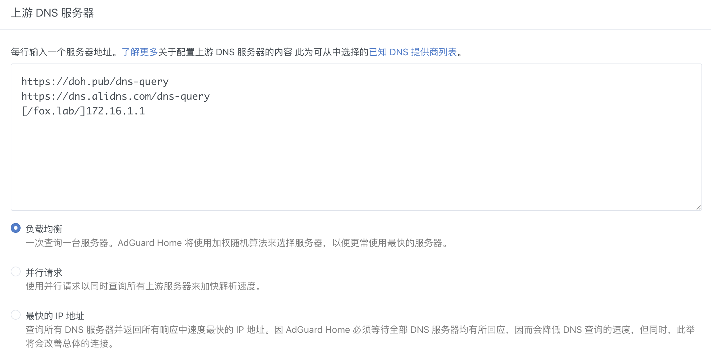

在 `Bootstrap DNS 服务器` 文本框中输入国内普通 DNS 的 IP 地址。  

国内普通 DNS IPv4 服务器地址如下：

```txt
119.29.29.29
223.5.5.5
223.6.6.6
```

国内普通 DNS IPv6 服务器地址如下：

```txt
2402:4e00::
2400:3200::1
2400:3200:baba::1
```

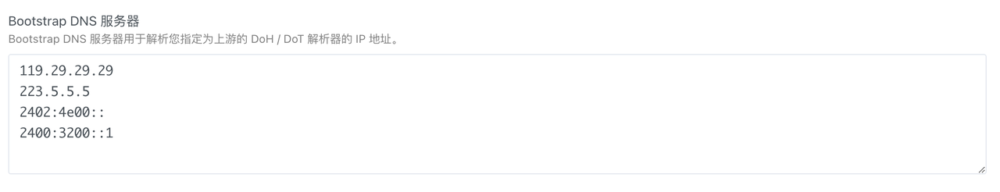

在 `私人反向 DNS 服务器` 文本对话框中输入当前内网 DNS 服务器的 IP 地址 `172.16.1.2` 、 `fdac::2` 。  

如果当前使用的 **路由器** 支持 PTR 查询，则也可以使用路由器的 IP 地址，例如 `172.16.1.1` 、 `fdac::1` 。  

同时，请勾选 `使用私人反向 DNS 解析器` 和 `启用客户端的 IP 地址的反向解析` 选项。  

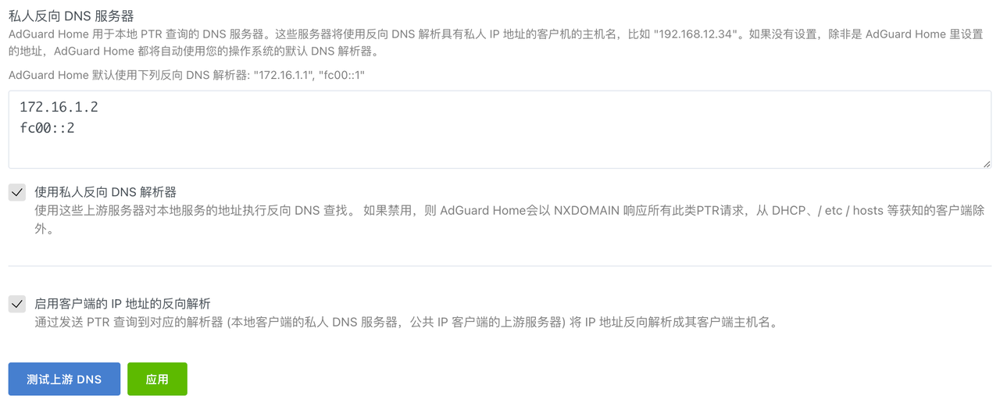

先点击 `应用` 按钮，再点击 `测试上游 DNS` 按钮，Adguard Home 会对配置进行自动确认。

### 4.2.DNS服务配置

将 `速度限制` 设为 `150` ，与 RouterOS 的 DNS 请求速度限制保持一致。  

勾选 `启用DNSSEC` 选项。  

`拦截模式` 保持 `默认` 。  

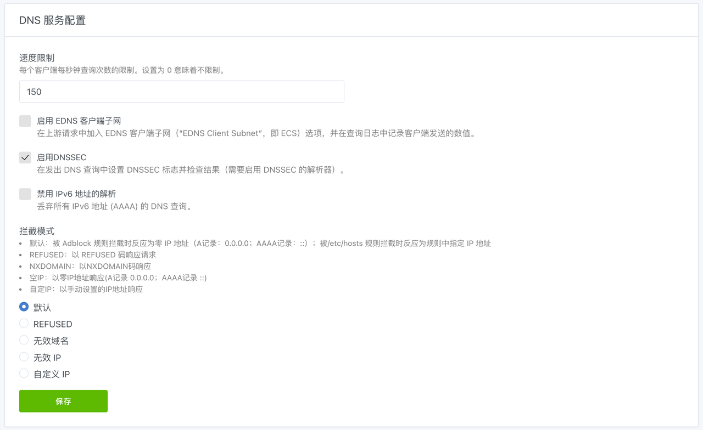

### 4.3.DNS缓存配置

默认的 DNS 缓存比较小，修改参数为 `10485760` ，计算方式为 `10Mb x 1024 x 1024` 。  

建议 **不要** 勾选 `乐观缓存` 选项，可能导致部分网站访问异常。

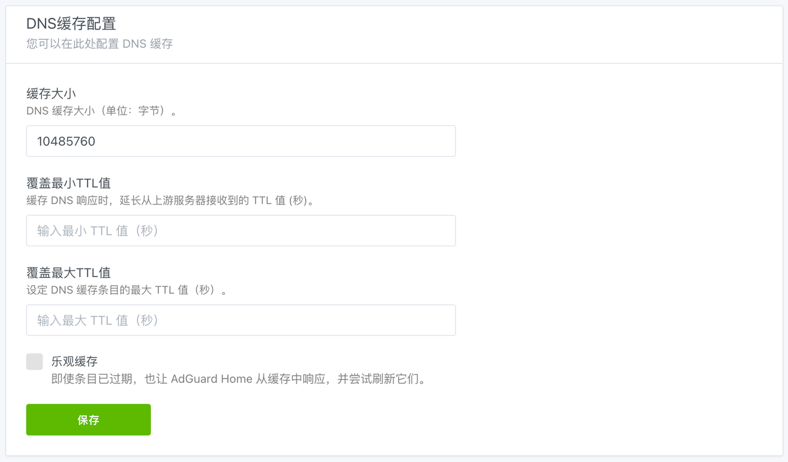

### 4.4.访问设置

在 `允许的客户端` 文本对话框中输入以下内容：

```txt
127.0.0.1
172.16.1.0/24
::1
fdac::/64
fe80::/10

```

其中 `172.16.1.0/24` 、 `fdac::/64` 表示内网的网络地址段。

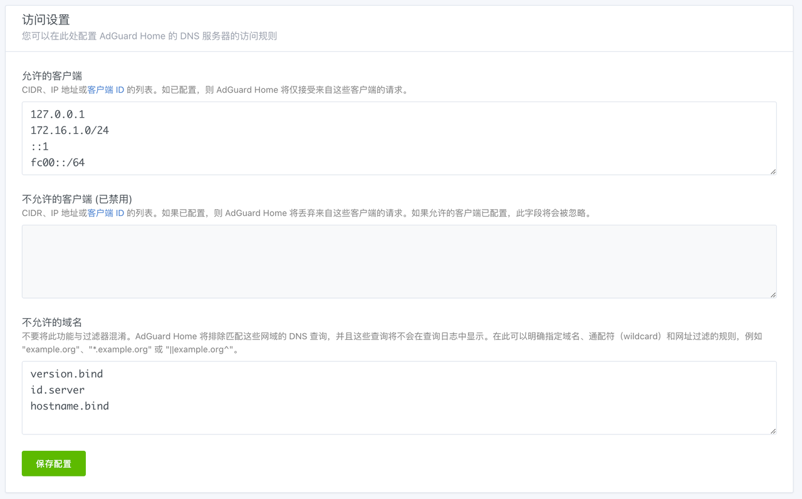

## 5.DNS拦截列表设置

Adguard Home 的广告拦截功能是通过加载广告拦截 hosts 的方式实现的。

点击顶部菜单 `过滤器` 的子菜单 `DNS拦截列表` ，此时可以看到默认的两个拦截列表：  

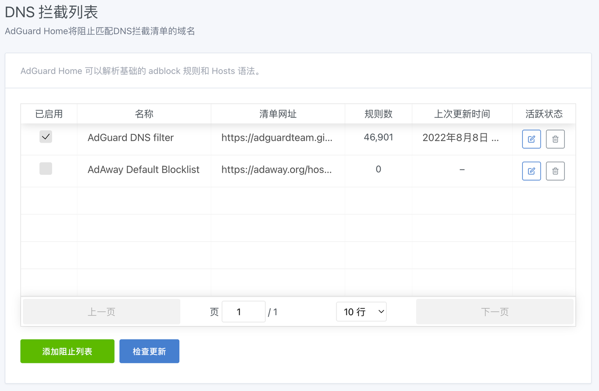

在 `已启用` 栏中取消勾选，并点击右侧 `删除` 按钮，将默认拦截列表删除。  

点击 `添加阻止列表` 按钮，并在弹出的对话框中点击 `添加一个自定义列表` 按钮 ：

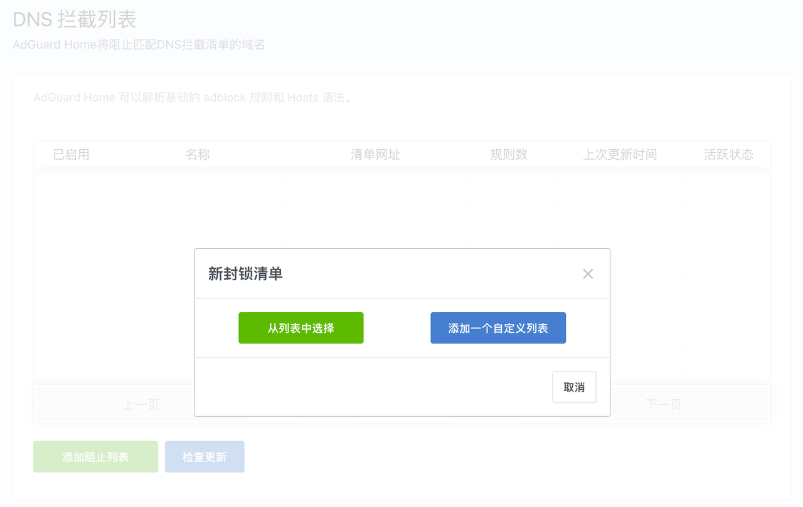

在 `新封锁清单` 对话框中输入 `列表名称` 以及 `列表地址` ，点击 `保存` 按钮即可 ：

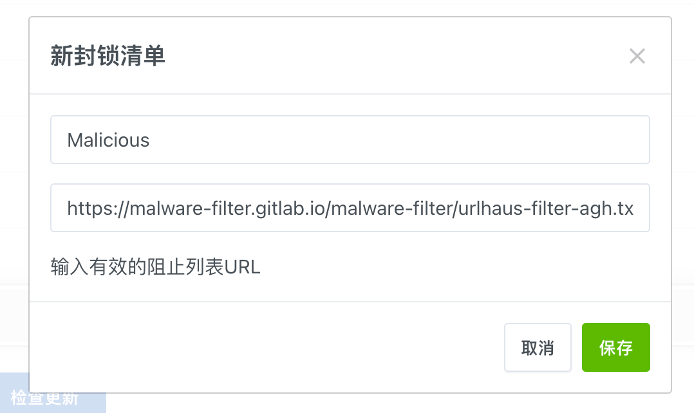

我目前常用的两个封锁清单如下：  

1. `Malicious` 用于拦截病毒地址：

```txt
## 列表名称
Malicious

## 列表链接地址
https://malware-filter.gitlab.io/malware-filter/urlhaus-filter-agh.txt
```

2. `Anti-AD` 用于拦截国内广告地址:

```txt
## 列表名称
Anti-AD

## 列表链接地址
https://anti-ad.net/easylist.txt
```

自定义拦截列表添加完成后，确保 `已启用` 为勾选状态，如下图所示：

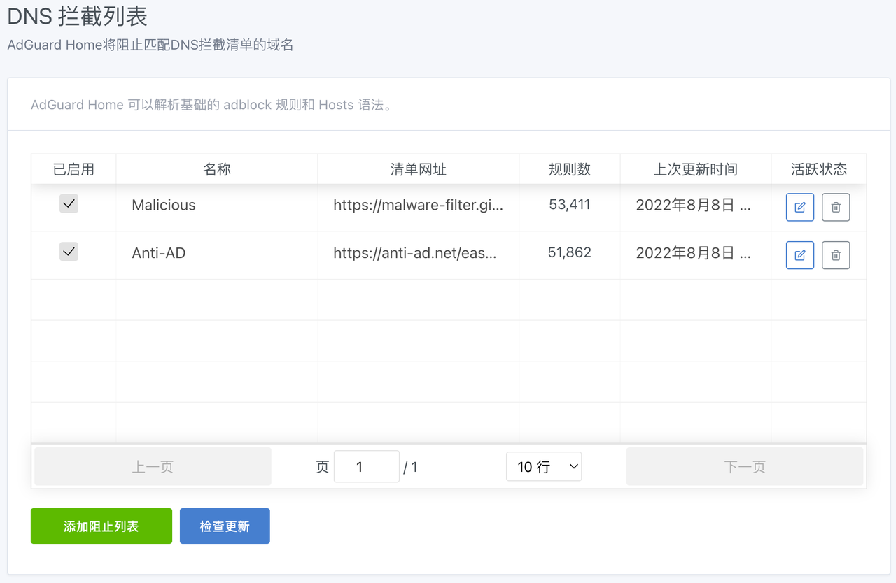

至此 Adguard Home 已设置完成，可以在顶部菜单 `查询日志` 中看到被拦截的 DNS 请求。

目前收集到的比较好的 `拦截列表` 地址记录如下：  

```txt
## 列表名称
Adblock Plus 2.0

## 项目链接地址
https://adrules.top
```

```txt
## 列表名称
OISD Basic

## 列表链接地址
https://abp.oisd.nl/basic/
```

```txt
## 列表名称
OISD FULL

## 列表链接地址
https://abp.oisd.nl
```

```txt
## 列表名称
StevenBlack

## 列表链接地址
https://raw.githubusercontent.com/StevenBlack/hosts/master/hosts
```

```txt
## 列表名称
AdAway

## 列表链接地址
https://adaway.org/hosts.txt
```

```txt
## 列表名称
HalfLife Ad

## 项目链接地址
https://github.com/o0HalfLife0o/list
```

## 6.修改主路由DHCP和DNS设置

修改主路由 RouterOS 的 DHCP 服务器，让内网设备在获取 IP 地址时，自动设置 DNS 服务器为 Adguard Home 的 IP 地址即可。

具体设置方法，请查阅系列文章《[RouterOS 折腾手记](https://gitee.com/callmer/routeros_toss_notes)》中的《RouterOS使用内网DNS服务器》部分。
