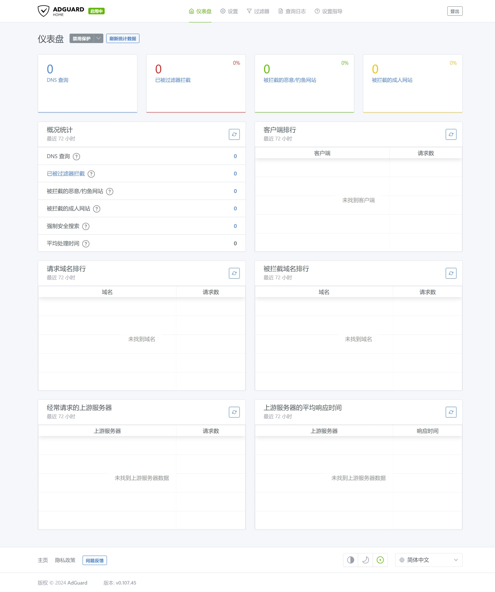
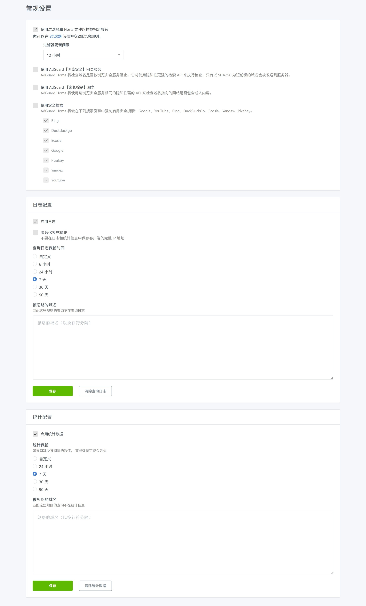
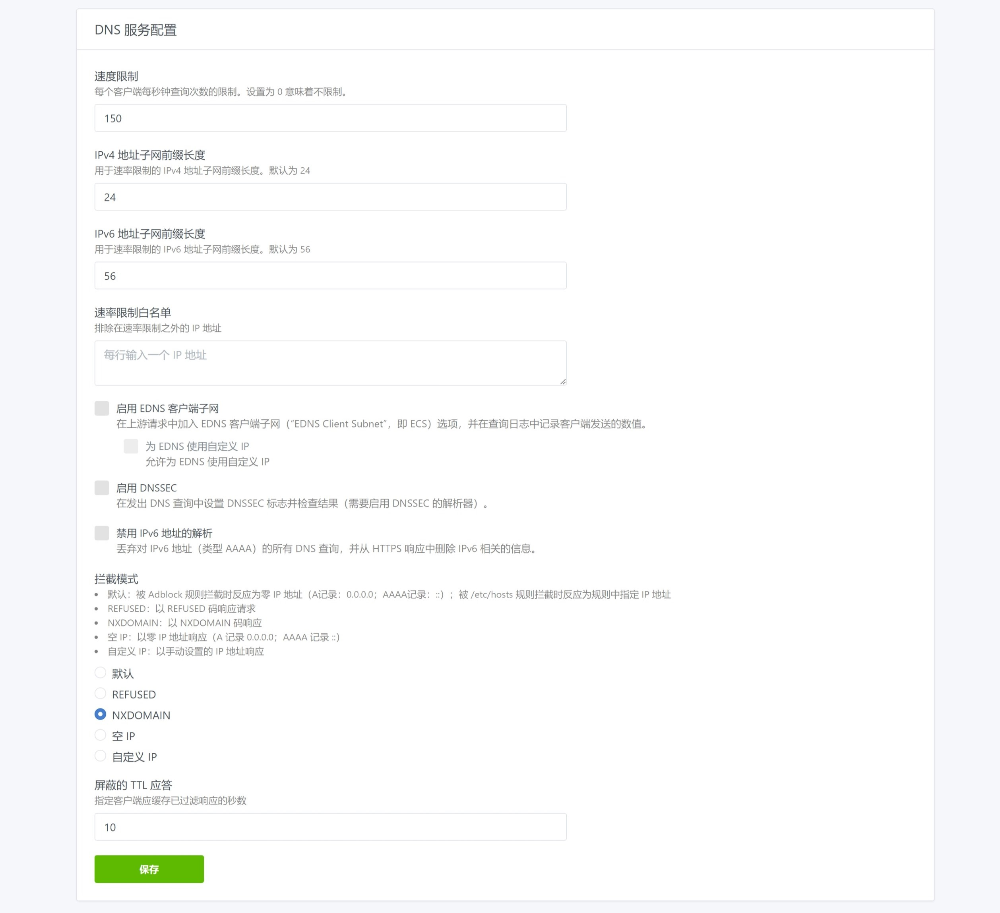
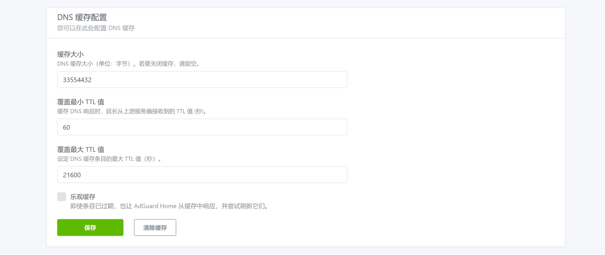
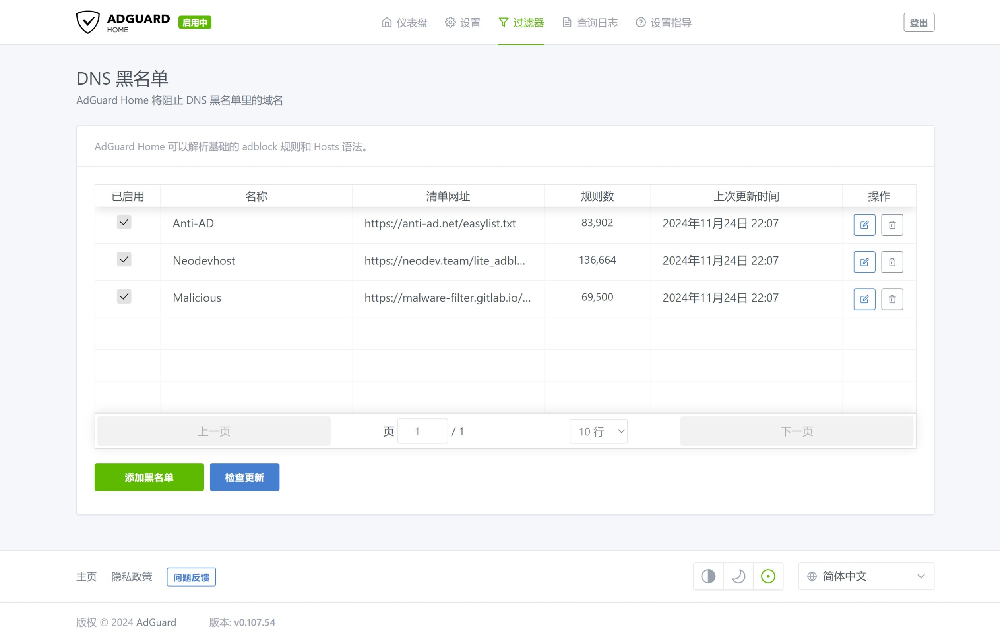

## 1.网页管理界面

Adguard Home 服务器的 IPv4 地址为 `172.16.1.2` 。  

在浏览器中访问 `http://172.16.1.2` 即可打开 Adguard Home 的网页管理界面。   


## 2. AGH 仪表盘

Adguard Home 的仪表盘将显示近期的一些统计数据。  



## 3.常规设置

点击顶部菜单 `设置` 的子菜单 `常规设置` ，修改其中的配置。  


|配置分组|参数|值|说明|
|--|--|--|--|
|常规设置|使用过滤器和 Hosts 文件以拦截指定域名|勾选|开启 DNS 过滤|
||过滤器更新间隔|`12 小时`|`过滤器` 更新周期|
|日志配置|启用日志|勾选|开启 DNS 查询日志记录|
||查询日志保留时间|`72 小时`|保留查询日志记录的时长|
|统计配置|启用统计数据|勾选|开启 DNS 查询统计|
||统计保留|`72 小时`|保留查询统计的时长|

在 `常规设置` 页面，将 `过滤器` 的更新周期设置为 `12小时` ：



## 4. DNS 设置

`DNS 设置` 为 Adguard Home 的核心配置内容。  

点击顶部菜单 `设置` 的子菜单 `DNS 设置` ，修改其中的配置项。  


### 4.1.上游 DNS 服务器

在 `上游 DNS 服务器` 文本框中输入 DoQ / DoT / DoH 服务器地址后，选择 `负载均衡` 。  

国内常用 DoQ / DoT / DoH 服务器地址如下。  

```bash
## DoQ 服务器
quic://dns.alidns.com

## DoT 服务器
tls://dot.pub
tls://dns.alidns.com

## DoH 服务器
https://doh.pub/dns-query
https://dns.alidns.com/dns-query
```

某些场景下，需额外指定 DNS 服务器来解析内网域名，在 `上游 DNS 服务器` 中添加对应 DNS 服务器参数即可。  

这里以 `*.home.arpa` 和 `172.16.1.1` 为演示。  

```bash
## 本地域名 DNS 服务器
[/*.home.arpa/]172.16.1.1
```

`后备 DNS 服务器` 用于在上游 DNS 服务器均不可用时作为备用 DNS 服务器。  

```bash
## 后备 DNS 服务器
8.8.4.4
8.8.8.8
223.5.5.5
223.6.6.6
180.184.1.1
180.184.2.2
52.80.66.66
117.50.10.10
119.29.29.29
114.114.114.114
114.114.115.115

2402:4e00::
2400:3200::1
2400:3200:baba::1
2001:4860:4860::8844
2001:4860:4860::8888
2400:7fc0:849e:200::4
2400:7fc0:849e:200::8
```

`Bootstrap DNS 服务器` 用于解析上游 DoQ / DoT / DoH 服务器的 IP 地址，使用国内普通 DNS 服务器即可。  

```bash
## Bootstrap DNS 服务器
tcp://223.5.5.5
tcp://223.6.6.6
tcp://180.184.1.1
tcp://180.184.2.2
tcp://52.80.66.66
tcp://114.114.114.114
tcp://114.114.115.115

tcp://2400:3200::1
tcp://2400:3200:baba::1
tcp://2400:7fc0:849e:200::4
```

`私人反向 DNS 服务器` 用于本地 PTR 查询的 DNS 服务器，一般填写主路由器的 IP 地址即可。  

`使用私人反向 DNS 解析器` 推荐勾选，以便于解析本地服务。  

`启用客户端的 IP 地址的反向解析` 推荐取消勾选，避免本地域名被发送给公共 DNS 服务器。  

点击 `应用` ，再点击 `测试上游 DNS` ，Adguard Home 会对配置进行自动确认。  


### 4.2. DNS 服务配置

`速度限制` 参数设为 `150` ，与主路由 DNS 请求速度限制保持一致。  

如果上游 DNS 服务器支持 `DNSSEC` 协议，可勾选 `启用DNSSEC` 选项。  

`拦截模式` 保持 `默认` 或使用 `NXDOMAIN` 选项。  



### 4.3. DNS 缓存配置

默认的 `缓存大小` 参数过小，建议修改为 `33554432` ，计算方式为 `32MiB x 1024 x 1024` 。  



### 4.4. DNS 访问设置

在 `允许的客户端` 文本对话框中输入以下内容，仅允许内网设备使用 Adguard Home 的 DNS 服务。  

```bash
## 内网地址段
172.16.1.0/24
fd00::/8
fe80::/10
127.0.0.1
::1
```


## 5. DNS 拦截

Adguard Home 广告拦截功能是通过加载 `拦截清单` 的方式实现的。  

点击顶部菜单 `过滤器` 的子菜单 `DNS 黑名单` ，此时可以看到默认的两个 `拦截清单` 。  

若无需使用默认的 `拦截清单` ，可将其删除。  


点击 `添加黑名单` ，并在弹出的对话框 `新封锁清单` 中点击 `添加一个自定义列表` 。  


在 `新封锁清单` 对话框中输入 `列表名称` 以及 `列表地址` ，点击 `保存` 即可。  

目前常用的封锁清单如下。  

1. `Anti-AD` 用于拦截广告地址。  

```bash
## 列表名称
Anti-AD

## 列表链接地址
https://anti-ad.net/easylist.txt
```

2. `Neodevhost` 用于拦截广告地址。  

```bash
## 列表名称
Neodevhost

## 列表链接地址
https://neodev.team/lite_adblocker
```

3. `Malicious` 用于拦截病毒地址。  

```bash
## 列表名称
Malicious

## 列表链接地址
https://malware-filter.gitlab.io/malware-filter/urlhaus-filter-agh.txt
```


自定义 `拦截清单` 添加完成后，确保 `已启用` 为勾选状态，如下图所示。  



## 6.内网设备 DNS

修改主路由相关设置，让内网设备在获取 IP 地址时，自动将其 DNS 服务器地址设置为 Adguard Home 的 IP 地址。  

具体设置方法，请参考系列文章 [RouterOS 折腾手记](https://gitee.com/callmer/routeros_toss_notes) 中的 DHCPv4 和 IPv6 相关内容。  

至此，内网 DNS 服务器已设置完成，可在 Adguard Home 顶部菜单 `查询日志` 中看到被拦截的 DNS 请求。  
